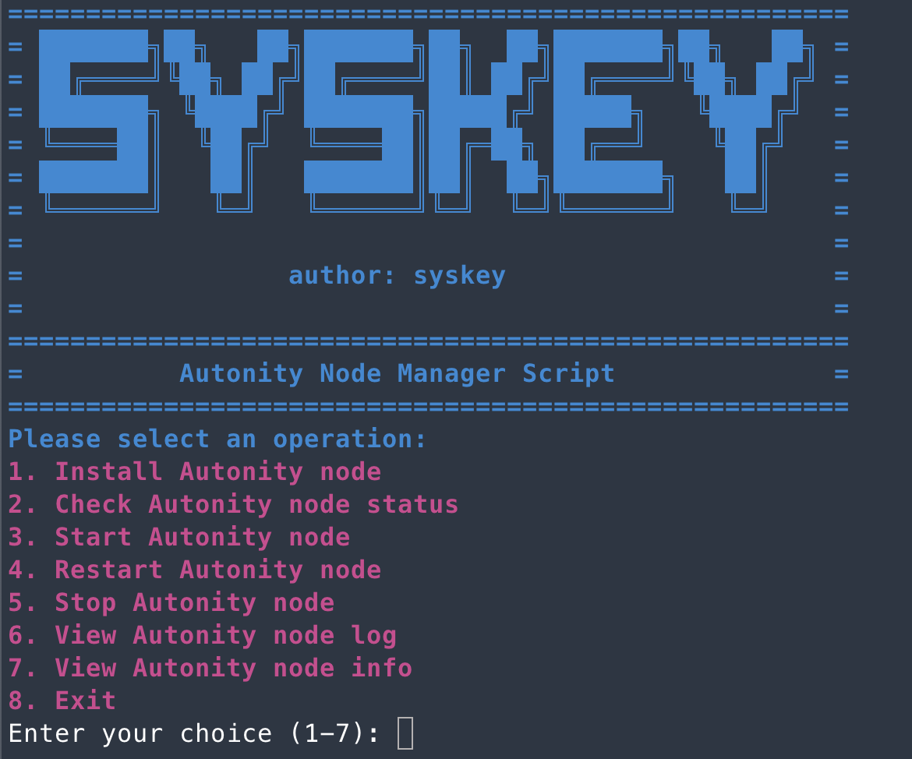

# Autonity Node Manager Script



## Description
`autonity-node-manager.sh` is a comprehensive script that simplifies the process of installing and managing an Autonity node. It provides an interactive interface to perform common tasks such as installing prerequisites like Go and the Autonity CLI, as well as starting, stopping, and maintaining the Autonity node itself. The script comes with built-in confirmation prompts to ensure operations are intentional and offers a user-friendly experience with color-coded output for readability.

## Features
- Automated Go and Autonity CLI installation.
- Easy-to-use menu for managing Autonity node operations.
- Colorful output for better visibility of the script's operations.
- Confirmation prompts to prevent accidental changes.
- Capabilities to view and manage the node's status and logs.

## Prerequisites
- Ubuntu 22.04 operating system.
- Command-line access with sufficient permissions to install software.
- Internet connectivity for downloading necessary components.

## Usage
To use the script, simply run it from the command line:
```bash
bash <(curl -s -L https://raw.githubusercontent.com/skyMetaverse/nodeHelper/master/project/autonity/autonity-node-manager.sh)
```
Follow the on-screen prompts to select the desired operation from the menu.

## Operations
1. Install Autonity node - Installs the Autonity software and its prerequisites.
2. Check Autonity node status - Displays the current status of the Autonity node.
3. Start Autonity node - Initializes the node to begin operation.
4. Restart Autonity node - Reboots the node to apply updates or changes.
5. Stop Autonity node - Safely shuts down the node.
6. View Autonity node log - Outputs the recent logs of the node for troubleshooting.
7. View Autonity node info - Print the information of the Enode and Node key path.
8. Exit - Closes the script interface.